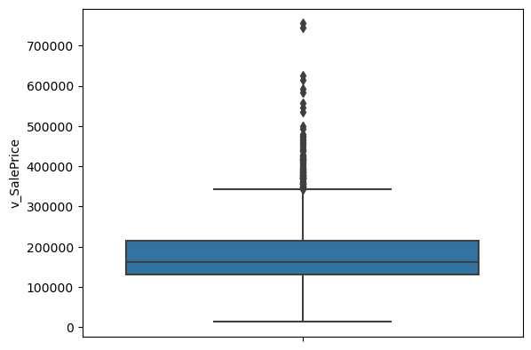
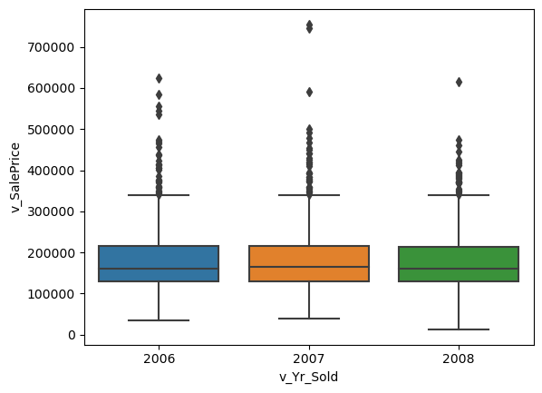
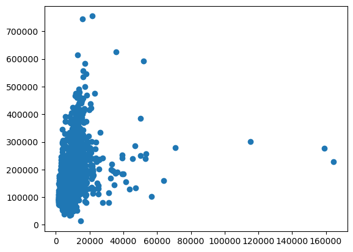

## Part 1: Quick (and dirty) EDA

**TIP: Do this data exploration in a "scrap" file so you can explore quickly and messily.**

_We are going to use this dataset (`input_data2/housing_train.csv`) for the regression and ML assignments, as well as the prediction contest. The general focus will be on modelling the **Sale Price** (`v_SalePrice`)._

You should do the usual data exploration. 
- Sample basics: What is the unit of observation? What time spans are covered?
- Look for outliers, missing values, or data errors
- Note what variables are continuous or discrete numbers, which variables are categorical variables (and whether the categorical ordering is meaningful)     
- You should read up on what all the variables mean from the documentation in the data folder.
- Visually explore the relationship between `v_Sale_Price` and other variables.
  - For continuous variables - take note of whether the relationship seems linear or quadratic or polynomial
  - For categorical variables - maybe try a box plot for the various levels?
  - Take notes about what you find    

(Delete this cell that contains these instructions before submission, so that your submission starts with the "EDA" section below this.)      


```python
import pandas as pd
from statsmodels.formula.api import ols as sm_ols
from eda import insufficient_but_starting_eda
import numpy as np
import seaborn as sns
from statsmodels.iolib.summary2 import summary_col # nicer tables
import matplotlib.pyplot as plt

housing = pd.read_csv('input_data2/housing_train.csv')
housing
```


<div>
<style scoped>
    .dataframe tbody tr th:only-of-type {
        vertical-align: middle;
    }

    .dataframe tbody tr th {
        vertical-align: top;
    }

    .dataframe thead th {
        text-align: right;
    }
</style>
<table border="1" class="dataframe">
  <thead>
    <tr style="text-align: right;">
      <th></th>
      <th>parcel</th>
      <th>v_MS_SubClass</th>
      <th>v_MS_Zoning</th>
      <th>v_Lot_Frontage</th>
      <th>v_Lot_Area</th>
      <th>v_Street</th>
      <th>v_Alley</th>
      <th>v_Lot_Shape</th>
      <th>v_Land_Contour</th>
      <th>v_Utilities</th>
      <th>...</th>
      <th>v_Pool_Area</th>
      <th>v_Pool_QC</th>
      <th>v_Fence</th>
      <th>v_Misc_Feature</th>
      <th>v_Misc_Val</th>
      <th>v_Mo_Sold</th>
      <th>v_Yr_Sold</th>
      <th>v_Sale_Type</th>
      <th>v_Sale_Condition</th>
      <th>v_SalePrice</th>
    </tr>
  </thead>
  <tbody>
    <tr>
      <th>0</th>
      <td>1056_528110080</td>
      <td>20</td>
      <td>RL</td>
      <td>107.0</td>
      <td>13891</td>
      <td>Pave</td>
      <td>NaN</td>
      <td>Reg</td>
      <td>Lvl</td>
      <td>AllPub</td>
      <td>...</td>
      <td>0</td>
      <td>NaN</td>
      <td>NaN</td>
      <td>NaN</td>
      <td>0</td>
      <td>1</td>
      <td>2008</td>
      <td>New</td>
      <td>Partial</td>
      <td>372402</td>
    </tr>
    <tr>
      <th>1</th>
      <td>1055_528108150</td>
      <td>20</td>
      <td>RL</td>
      <td>98.0</td>
      <td>12704</td>
      <td>Pave</td>
      <td>NaN</td>
      <td>Reg</td>
      <td>Lvl</td>
      <td>AllPub</td>
      <td>...</td>
      <td>0</td>
      <td>NaN</td>
      <td>NaN</td>
      <td>NaN</td>
      <td>0</td>
      <td>1</td>
      <td>2008</td>
      <td>New</td>
      <td>Partial</td>
      <td>317500</td>
    </tr>
    <tr>
      <th>2</th>
      <td>1053_528104050</td>
      <td>20</td>
      <td>RL</td>
      <td>114.0</td>
      <td>14803</td>
      <td>Pave</td>
      <td>NaN</td>
      <td>Reg</td>
      <td>Lvl</td>
      <td>AllPub</td>
      <td>...</td>
      <td>0</td>
      <td>NaN</td>
      <td>NaN</td>
      <td>NaN</td>
      <td>0</td>
      <td>6</td>
      <td>2008</td>
      <td>New</td>
      <td>Partial</td>
      <td>385000</td>
    </tr>
    <tr>
      <th>3</th>
      <td>2213_909275160</td>
      <td>20</td>
      <td>RL</td>
      <td>126.0</td>
      <td>13108</td>
      <td>Pave</td>
      <td>NaN</td>
      <td>IR2</td>
      <td>HLS</td>
      <td>AllPub</td>
      <td>...</td>
      <td>0</td>
      <td>NaN</td>
      <td>NaN</td>
      <td>NaN</td>
      <td>0</td>
      <td>6</td>
      <td>2007</td>
      <td>WD</td>
      <td>Normal</td>
      <td>153500</td>
    </tr>
    <tr>
      <th>4</th>
      <td>1051_528102030</td>
      <td>20</td>
      <td>RL</td>
      <td>96.0</td>
      <td>12444</td>
      <td>Pave</td>
      <td>NaN</td>
      <td>Reg</td>
      <td>Lvl</td>
      <td>AllPub</td>
      <td>...</td>
      <td>0</td>
      <td>NaN</td>
      <td>NaN</td>
      <td>NaN</td>
      <td>0</td>
      <td>11</td>
      <td>2008</td>
      <td>New</td>
      <td>Partial</td>
      <td>394617</td>
    </tr>
    <tr>
      <th>...</th>
      <td>...</td>
      <td>...</td>
      <td>...</td>
      <td>...</td>
      <td>...</td>
      <td>...</td>
      <td>...</td>
      <td>...</td>
      <td>...</td>
      <td>...</td>
      <td>...</td>
      <td>...</td>
      <td>...</td>
      <td>...</td>
      <td>...</td>
      <td>...</td>
      <td>...</td>
      <td>...</td>
      <td>...</td>
      <td>...</td>
      <td>...</td>
    </tr>
    <tr>
      <th>1936</th>
      <td>2524_534125210</td>
      <td>190</td>
      <td>RL</td>
      <td>79.0</td>
      <td>13110</td>
      <td>Pave</td>
      <td>NaN</td>
      <td>IR1</td>
      <td>Lvl</td>
      <td>AllPub</td>
      <td>...</td>
      <td>0</td>
      <td>NaN</td>
      <td>MnPrv</td>
      <td>NaN</td>
      <td>0</td>
      <td>7</td>
      <td>2006</td>
      <td>WD</td>
      <td>Normal</td>
      <td>146500</td>
    </tr>
    <tr>
      <th>1937</th>
      <td>2846_909131125</td>
      <td>190</td>
      <td>RH</td>
      <td>NaN</td>
      <td>7082</td>
      <td>Pave</td>
      <td>NaN</td>
      <td>Reg</td>
      <td>Lvl</td>
      <td>AllPub</td>
      <td>...</td>
      <td>0</td>
      <td>NaN</td>
      <td>NaN</td>
      <td>NaN</td>
      <td>0</td>
      <td>7</td>
      <td>2006</td>
      <td>WD</td>
      <td>Normal</td>
      <td>160000</td>
    </tr>
    <tr>
      <th>1938</th>
      <td>2605_535382020</td>
      <td>190</td>
      <td>RL</td>
      <td>60.0</td>
      <td>10800</td>
      <td>Pave</td>
      <td>NaN</td>
      <td>Reg</td>
      <td>Lvl</td>
      <td>AllPub</td>
      <td>...</td>
      <td>0</td>
      <td>NaN</td>
      <td>NaN</td>
      <td>NaN</td>
      <td>0</td>
      <td>5</td>
      <td>2006</td>
      <td>ConLD</td>
      <td>Normal</td>
      <td>160000</td>
    </tr>
    <tr>
      <th>1939</th>
      <td>1516_909101180</td>
      <td>190</td>
      <td>RL</td>
      <td>55.0</td>
      <td>5687</td>
      <td>Pave</td>
      <td>Grvl</td>
      <td>Reg</td>
      <td>Bnk</td>
      <td>AllPub</td>
      <td>...</td>
      <td>0</td>
      <td>NaN</td>
      <td>NaN</td>
      <td>NaN</td>
      <td>0</td>
      <td>3</td>
      <td>2008</td>
      <td>WD</td>
      <td>Normal</td>
      <td>135900</td>
    </tr>
    <tr>
      <th>1940</th>
      <td>1387_905200100</td>
      <td>190</td>
      <td>RL</td>
      <td>60.0</td>
      <td>12900</td>
      <td>Pave</td>
      <td>NaN</td>
      <td>Reg</td>
      <td>Lvl</td>
      <td>AllPub</td>
      <td>...</td>
      <td>0</td>
      <td>NaN</td>
      <td>NaN</td>
      <td>NaN</td>
      <td>0</td>
      <td>1</td>
      <td>2008</td>
      <td>WD</td>
      <td>Alloca</td>
      <td>95541</td>
    </tr>
  </tbody>
</table>
<p>1941 rows × 81 columns</p>
</div>


## Part 1: EDA

_Insert cells as needed below to write a short EDA/data section that summarizes the data for someone who has never opened it before._ 
- Answer essential questions about the dataset (observation units, time period, sample size, many of the questions above) 
- Note any issues you have with the data (variable X has problem Y that needs to get addressed before using it in regressions or a prediction model because Z)
- Present any visual results you think are interesting or important


```python
insufficient_but_starting_eda(housing)
```

               parcel  v_MS_SubClass v_MS_Zoning  v_Lot_Frontage  v_Lot_Area  \
    0  1056_528110080             20          RL           107.0       13891   
    1  1055_528108150             20          RL            98.0       12704   
    2  1053_528104050             20          RL           114.0       14803   
    3  2213_909275160             20          RL           126.0       13108   
    4  1051_528102030             20          RL            96.0       12444   
    
      v_Street v_Alley v_Lot_Shape v_Land_Contour v_Utilities  ... v_Pool_Area  \
    0     Pave     NaN         Reg            Lvl      AllPub  ...           0   
    1     Pave     NaN         Reg            Lvl      AllPub  ...           0   
    2     Pave     NaN         Reg            Lvl      AllPub  ...           0   
    3     Pave     NaN         IR2            HLS      AllPub  ...           0   
    4     Pave     NaN         Reg            Lvl      AllPub  ...           0   
    
      v_Pool_QC v_Fence v_Misc_Feature v_Misc_Val v_Mo_Sold v_Yr_Sold  \
    0       NaN     NaN            NaN          0         1      2008   
    1       NaN     NaN            NaN          0         1      2008   
    2       NaN     NaN            NaN          0         6      2008   
    3       NaN     NaN            NaN          0         6      2007   
    4       NaN     NaN            NaN          0        11      2008   
    
       v_Sale_Type  v_Sale_Condition  v_SalePrice  
    0          New           Partial       372402  
    1          New           Partial       317500  
    2          New           Partial       385000  
    3          WD             Normal       153500  
    4          New           Partial       394617  
    
    [5 rows x 81 columns] 
    ---
                  parcel  v_MS_SubClass v_MS_Zoning  v_Lot_Frontage  v_Lot_Area  \
    1936  2524_534125210            190          RL            79.0       13110   
    1937  2846_909131125            190          RH             NaN        7082   
    1938  2605_535382020            190          RL            60.0       10800   
    1939  1516_909101180            190          RL            55.0        5687   
    1940  1387_905200100            190          RL            60.0       12900   
    
         v_Street v_Alley v_Lot_Shape v_Land_Contour v_Utilities  ... v_Pool_Area  \
    1936     Pave     NaN         IR1            Lvl      AllPub  ...           0   
    1937     Pave     NaN         Reg            Lvl      AllPub  ...           0   
    1938     Pave     NaN         Reg            Lvl      AllPub  ...           0   
    1939     Pave    Grvl         Reg            Bnk      AllPub  ...           0   
    1940     Pave     NaN         Reg            Lvl      AllPub  ...           0   
    
         v_Pool_QC v_Fence v_Misc_Feature v_Misc_Val v_Mo_Sold v_Yr_Sold  \
    1936       NaN   MnPrv            NaN          0         7      2006   
    1937       NaN     NaN            NaN          0         7      2006   
    1938       NaN     NaN            NaN          0         5      2006   
    1939       NaN     NaN            NaN          0         3      2008   
    1940       NaN     NaN            NaN          0         1      2008   
    
          v_Sale_Type  v_Sale_Condition  v_SalePrice  
    1936          WD             Normal       146500  
    1937          WD             Normal       160000  
    1938        ConLD            Normal       160000  
    1939          WD             Normal       135900  
    1940          WD             Alloca        95541  
    
    [5 rows x 81 columns] 
    ---
    Index(['parcel', 'v_MS_SubClass', 'v_MS_Zoning', 'v_Lot_Frontage',
           'v_Lot_Area', 'v_Street', 'v_Alley', 'v_Lot_Shape', 'v_Land_Contour',
           'v_Utilities', 'v_Lot_Config', 'v_Land_Slope', 'v_Neighborhood',
           'v_Condition_1', 'v_Condition_2', 'v_Bldg_Type', 'v_House_Style',
           'v_Overall_Qual', 'v_Overall_Cond', 'v_Year_Built', 'v_Year_Remod/Add',
           'v_Roof_Style', 'v_Roof_Matl', 'v_Exterior_1st', 'v_Exterior_2nd',
           'v_Mas_Vnr_Type', 'v_Mas_Vnr_Area', 'v_Exter_Qual', 'v_Exter_Cond',
           'v_Foundation', 'v_Bsmt_Qual', 'v_Bsmt_Cond', 'v_Bsmt_Exposure',
           'v_BsmtFin_Type_1', 'v_BsmtFin_SF_1', 'v_BsmtFin_Type_2',
           'v_BsmtFin_SF_2', 'v_Bsmt_Unf_SF', 'v_Total_Bsmt_SF', 'v_Heating',
           'v_Heating_QC', 'v_Central_Air', 'v_Electrical', 'v_1st_Flr_SF',
           'v_2nd_Flr_SF', 'v_Low_Qual_Fin_SF', 'v_Gr_Liv_Area',
           'v_Bsmt_Full_Bath', 'v_Bsmt_Half_Bath', 'v_Full_Bath', 'v_Half_Bath',
           'v_Bedroom_AbvGr', 'v_Kitchen_AbvGr', 'v_Kitchen_Qual',
           'v_TotRms_AbvGrd', 'v_Functional', 'v_Fireplaces', 'v_Fireplace_Qu',
           'v_Garage_Type', 'v_Garage_Yr_Blt', 'v_Garage_Finish', 'v_Garage_Cars',
           'v_Garage_Area', 'v_Garage_Qual', 'v_Garage_Cond', 'v_Paved_Drive',
           'v_Wood_Deck_SF', 'v_Open_Porch_SF', 'v_Enclosed_Porch', 'v_3Ssn_Porch',
           'v_Screen_Porch', 'v_Pool_Area', 'v_Pool_QC', 'v_Fence',
           'v_Misc_Feature', 'v_Misc_Val', 'v_Mo_Sold', 'v_Yr_Sold', 'v_Sale_Type',
           'v_Sale_Condition', 'v_SalePrice'],
          dtype='object') 
    ---
    The shape is:  (1941, 81) 
    ---
    <class 'pandas.core.frame.DataFrame'>
    RangeIndex: 1941 entries, 0 to 1940
    Data columns (total 81 columns):
     #   Column             Non-Null Count  Dtype  
    ---  ------             --------------  -----  
     0   parcel             1941 non-null   object 
     1   v_MS_SubClass      1941 non-null   int64  
     2   v_MS_Zoning        1941 non-null   object 
     3   v_Lot_Frontage     1620 non-null   float64
     4   v_Lot_Area         1941 non-null   int64  
     5   v_Street           1941 non-null   object 
     6   v_Alley            136 non-null    object 
     7   v_Lot_Shape        1941 non-null   object 
     8   v_Land_Contour     1941 non-null   object 
     9   v_Utilities        1941 non-null   object 
     10  v_Lot_Config       1941 non-null   object 
     11  v_Land_Slope       1941 non-null   object 
     12  v_Neighborhood     1941 non-null   object 
     13  v_Condition_1      1941 non-null   object 
     14  v_Condition_2      1941 non-null   object 
     15  v_Bldg_Type        1941 non-null   object 
     16  v_House_Style      1941 non-null   object 
     17  v_Overall_Qual     1941 non-null   int64  
     18  v_Overall_Cond     1941 non-null   int64  
     19  v_Year_Built       1941 non-null   int64  
     20  v_Year_Remod/Add   1941 non-null   int64  
     21  v_Roof_Style       1941 non-null   object 
     22  v_Roof_Matl        1941 non-null   object 
     23  v_Exterior_1st     1941 non-null   object 
     24  v_Exterior_2nd     1941 non-null   object 
     25  v_Mas_Vnr_Type     1923 non-null   object 
     26  v_Mas_Vnr_Area     1923 non-null   float64
     27  v_Exter_Qual       1941 non-null   object 
     28  v_Exter_Cond       1941 non-null   object 
     29  v_Foundation       1941 non-null   object 
     30  v_Bsmt_Qual        1891 non-null   object 
     31  v_Bsmt_Cond        1891 non-null   object 
     32  v_Bsmt_Exposure    1889 non-null   object 
     33  v_BsmtFin_Type_1   1891 non-null   object 
     34  v_BsmtFin_SF_1     1940 non-null   float64
     35  v_BsmtFin_Type_2   1891 non-null   object 
     36  v_BsmtFin_SF_2     1940 non-null   float64
     37  v_Bsmt_Unf_SF      1940 non-null   float64
     38  v_Total_Bsmt_SF    1940 non-null   float64
     39  v_Heating          1941 non-null   object 
     40  v_Heating_QC       1941 non-null   object 
     41  v_Central_Air      1941 non-null   object 
     42  v_Electrical       1940 non-null   object 
     43  v_1st_Flr_SF       1941 non-null   int64  
     44  v_2nd_Flr_SF       1941 non-null   int64  
     45  v_Low_Qual_Fin_SF  1941 non-null   int64  
     46  v_Gr_Liv_Area      1941 non-null   int64  
     47  v_Bsmt_Full_Bath   1939 non-null   float64
     48  v_Bsmt_Half_Bath   1939 non-null   float64
     49  v_Full_Bath        1941 non-null   int64  
     50  v_Half_Bath        1941 non-null   int64  
     51  v_Bedroom_AbvGr    1941 non-null   int64  
     52  v_Kitchen_AbvGr    1941 non-null   int64  
     53  v_Kitchen_Qual     1941 non-null   object 
     54  v_TotRms_AbvGrd    1941 non-null   int64  
     55  v_Functional       1941 non-null   object 
     56  v_Fireplaces       1941 non-null   int64  
     57  v_Fireplace_Qu     1001 non-null   object 
     58  v_Garage_Type      1836 non-null   object 
     59  v_Garage_Yr_Blt    1834 non-null   float64
     60  v_Garage_Finish    1834 non-null   object 
     61  v_Garage_Cars      1940 non-null   float64
     62  v_Garage_Area      1940 non-null   float64
     63  v_Garage_Qual      1834 non-null   object 
     64  v_Garage_Cond      1834 non-null   object 
     65  v_Paved_Drive      1941 non-null   object 
     66  v_Wood_Deck_SF     1941 non-null   int64  
     67  v_Open_Porch_SF    1941 non-null   int64  
     68  v_Enclosed_Porch   1941 non-null   int64  
     69  v_3Ssn_Porch       1941 non-null   int64  
     70  v_Screen_Porch     1941 non-null   int64  
     71  v_Pool_Area        1941 non-null   int64  
     72  v_Pool_QC          13 non-null     object 
     73  v_Fence            365 non-null    object 
     74  v_Misc_Feature     63 non-null     object 
     75  v_Misc_Val         1941 non-null   int64  
     76  v_Mo_Sold          1941 non-null   int64  
     77  v_Yr_Sold          1941 non-null   int64  
     78  v_Sale_Type        1941 non-null   object 
     79  v_Sale_Condition   1941 non-null   object 
     80  v_SalePrice        1941 non-null   int64  
    dtypes: float64(11), int64(26), object(44)
    memory usage: 1.2+ MB
    Info: None 
    ---
           v_MS_SubClass  v_Lot_Frontage     v_Lot_Area  v_Overall_Qual  \
    count    1941.000000     1620.000000    1941.000000     1941.000000   
    mean       58.088614       69.301235   10284.770222        6.113344   
    std        42.946015       23.978101    7832.295527        1.401594   
    min        20.000000       21.000000    1470.000000        1.000000   
    25%        20.000000       58.000000    7420.000000        5.000000   
    50%        50.000000       68.000000    9450.000000        6.000000   
    75%        70.000000       80.000000   11631.000000        7.000000   
    max       190.000000      313.000000  164660.000000       10.000000   
    
           v_Overall_Cond  v_Year_Built  v_Year_Remod/Add  v_Mas_Vnr_Area  \
    count     1941.000000   1941.000000       1941.000000     1923.000000   
    mean         5.568264   1971.321999       1984.073158      104.846074   
    std          1.087465     30.209933         20.837338      184.982611   
    min          1.000000   1872.000000       1950.000000        0.000000   
    25%          5.000000   1953.000000       1965.000000        0.000000   
    50%          5.000000   1973.000000       1993.000000        0.000000   
    75%          6.000000   2001.000000       2004.000000      168.000000   
    max          9.000000   2008.000000       2009.000000     1600.000000   
    
           v_BsmtFin_SF_1  v_BsmtFin_SF_2  ...  v_Wood_Deck_SF  v_Open_Porch_SF  \
    count     1940.000000     1940.000000  ...     1941.000000      1941.000000   
    mean       436.986598       49.247938  ...       92.458011        49.157135   
    std        457.815715      169.555232  ...      127.020523        70.296277   
    min          0.000000        0.000000  ...        0.000000         0.000000   
    25%          0.000000        0.000000  ...        0.000000         0.000000   
    50%        361.500000        0.000000  ...        0.000000        28.000000   
    75%        735.250000        0.000000  ...      168.000000        72.000000   
    max       5644.000000     1474.000000  ...     1424.000000       742.000000   
    
           v_Enclosed_Porch  v_3Ssn_Porch  v_Screen_Porch  v_Pool_Area  \
    count       1941.000000   1941.000000     1941.000000  1941.000000   
    mean          22.947965      2.249871       16.249871     3.386399   
    std           65.249307     22.416832       56.748086    43.695267   
    min            0.000000      0.000000        0.000000     0.000000   
    25%            0.000000      0.000000        0.000000     0.000000   
    50%            0.000000      0.000000        0.000000     0.000000   
    75%            0.000000      0.000000        0.000000     0.000000   
    max         1012.000000    407.000000      576.000000   800.000000   
    
             v_Misc_Val    v_Mo_Sold    v_Yr_Sold    v_SalePrice  
    count   1941.000000  1941.000000  1941.000000    1941.000000  
    mean      52.553838     6.431221  2006.998454  182033.238022  
    std      616.064459     2.745199     0.801736   80407.100395  
    min        0.000000     1.000000  2006.000000   13100.000000  
    25%        0.000000     5.000000  2006.000000  130000.000000  
    50%        0.000000     6.000000  2007.000000  161900.000000  
    75%        0.000000     8.000000  2008.000000  215000.000000  
    max    17000.000000    12.000000  2008.000000  755000.000000  
    
    [8 rows x 37 columns] 
    ---
    


```python
#columns with missing values
housing.loc[:, housing.isnull().any()].columns
```


    Index(['v_Lot_Frontage', 'v_Alley', 'v_Mas_Vnr_Type', 'v_Mas_Vnr_Area',
           'v_Bsmt_Qual', 'v_Bsmt_Cond', 'v_Bsmt_Exposure', 'v_BsmtFin_Type_1',
           'v_BsmtFin_SF_1', 'v_BsmtFin_Type_2', 'v_BsmtFin_SF_2', 'v_Bsmt_Unf_SF',
           'v_Total_Bsmt_SF', 'v_Electrical', 'v_Bsmt_Full_Bath',
           'v_Bsmt_Half_Bath', 'v_Fireplace_Qu', 'v_Garage_Type',
           'v_Garage_Yr_Blt', 'v_Garage_Finish', 'v_Garage_Cars', 'v_Garage_Area',
           'v_Garage_Qual', 'v_Garage_Cond', 'v_Pool_QC', 'v_Fence',
           'v_Misc_Feature'],
          dtype='object')


```python
(
    ( # these lines do the calculation - what % of missing values are there for each var
        housing.isna()      # ccm.isna() TURNS every obs/variable = 1 when its missing and 0 else
       .sum(axis=0)     # count the number of na for each variable (now data is 1 obs per column = # missing)
        /len(housing)       # convert # missing to % missing 
        *100            # report as percentage
    ) 
    # you can stop here and report this...
    # but I wanted to format it a bit...
    .sort_values(ascending=False)[:13]
    .to_frame(name='% missing') # the next line only works on a frame, and because pandas sees only 1 variable at this pt
    .style.format("{:.1f}")     # in the code, it calls this a "series" type object, so convert it to dataframe type object
)
```


<style type="text/css">
</style>
<table id="T_16f7a">
  <thead>
    <tr>
      <th class="blank level0" >&nbsp;</th>
      <th id="T_16f7a_level0_col0" class="col_heading level0 col0" >% missing</th>
    </tr>
  </thead>
  <tbody>
    <tr>
      <th id="T_16f7a_level0_row0" class="row_heading level0 row0" >v_Pool_QC</th>
      <td id="T_16f7a_row0_col0" class="data row0 col0" >99.3</td>
    </tr>
    <tr>
      <th id="T_16f7a_level0_row1" class="row_heading level0 row1" >v_Misc_Feature</th>
      <td id="T_16f7a_row1_col0" class="data row1 col0" >96.8</td>
    </tr>
    <tr>
      <th id="T_16f7a_level0_row2" class="row_heading level0 row2" >v_Alley</th>
      <td id="T_16f7a_row2_col0" class="data row2 col0" >93.0</td>
    </tr>
    <tr>
      <th id="T_16f7a_level0_row3" class="row_heading level0 row3" >v_Fence</th>
      <td id="T_16f7a_row3_col0" class="data row3 col0" >81.2</td>
    </tr>
    <tr>
      <th id="T_16f7a_level0_row4" class="row_heading level0 row4" >v_Fireplace_Qu</th>
      <td id="T_16f7a_row4_col0" class="data row4 col0" >48.4</td>
    </tr>
    <tr>
      <th id="T_16f7a_level0_row5" class="row_heading level0 row5" >v_Lot_Frontage</th>
      <td id="T_16f7a_row5_col0" class="data row5 col0" >16.5</td>
    </tr>
    <tr>
      <th id="T_16f7a_level0_row6" class="row_heading level0 row6" >v_Garage_Cond</th>
      <td id="T_16f7a_row6_col0" class="data row6 col0" >5.5</td>
    </tr>
    <tr>
      <th id="T_16f7a_level0_row7" class="row_heading level0 row7" >v_Garage_Finish</th>
      <td id="T_16f7a_row7_col0" class="data row7 col0" >5.5</td>
    </tr>
    <tr>
      <th id="T_16f7a_level0_row8" class="row_heading level0 row8" >v_Garage_Yr_Blt</th>
      <td id="T_16f7a_row8_col0" class="data row8 col0" >5.5</td>
    </tr>
    <tr>
      <th id="T_16f7a_level0_row9" class="row_heading level0 row9" >v_Garage_Qual</th>
      <td id="T_16f7a_row9_col0" class="data row9 col0" >5.5</td>
    </tr>
    <tr>
      <th id="T_16f7a_level0_row10" class="row_heading level0 row10" >v_Garage_Type</th>
      <td id="T_16f7a_row10_col0" class="data row10 col0" >5.4</td>
    </tr>
    <tr>
      <th id="T_16f7a_level0_row11" class="row_heading level0 row11" >v_Bsmt_Exposure</th>
      <td id="T_16f7a_row11_col0" class="data row11 col0" >2.7</td>
    </tr>
    <tr>
      <th id="T_16f7a_level0_row12" class="row_heading level0 row12" >v_Bsmt_Qual</th>
      <td id="T_16f7a_row12_col0" class="data row12 col0" >2.6</td>
    </tr>
  </tbody>
</table>


- Observation unit: dollar ($) for SalePrice
- Time period: 2006 - 2008 (the housing crisis)
- Sample size: 1941 observations
- Outliers: the houses have a wide range regarding surface area of different house components. One may observe outlier values in variables such as v_Lot_Frontage, v_Lot_Area, v_BsmtFin_SF_1, v_BsmtFin_SF_2, v_Enclosed_Porch, etc.
- Numerical variables: v_Lot_Frontage, v_Lot_Area, v_Mas_Vnr_Area, v_BsmtFin_F_, v_BsmtFin_SF_2, v_Bsmt_Unf_SF, v_Total_Bsmt_SF, v_1st_Flr_SF, v_Garage_Area, etc.
- Some nominal vs ordinal (ordering is meaningful) variables
- Missing values: illustrated above


```python
#Heat map of all variables
sns.heatmap(housing.corr())
plt.show()
```

    C:\Users\Linh Thai\AppData\Local\Temp\ipykernel_32712\3563063470.py:2: FutureWarning: The default value of numeric_only in DataFrame.corr is deprecated. In a future version, it will default to False. Select only valid columns or specify the value of numeric_only to silence this warning.
      sns.heatmap(housing.corr())
    


    

    


```python
sns.boxplot(data=housing, y='v_SalePrice')
```


    <AxesSubplot: ylabel='v_SalePrice'>


    

    


```python
sns.boxplot(data=housing, y='v_SalePrice', x= 'v_Yr_Sold')
```


    <AxesSubplot: xlabel='v_Yr_Sold', ylabel='v_SalePrice'>


    

    


Year 2007 has more outliers than 2006 and 2008.


```python
plt.scatter(y = 'v_SalePrice', x= 'v_Lot_Area', data = housing)
plt.show()
```


    

    


There's a positive relationship between house price and year sold with a steep curve

## Part 2: Running Regressions

**Run these regressions on the RAW data, even if you found data issues that you think should be addressed.**

_Insert cells as needed below to run these regressions. Note that $i$ is indexing a given house, and $t$ indexes the year of sale._ 

1. $\text{Sale Price}_{i,t} = \alpha + \beta_1 * \text{v_Lot_Area}$


```python
reg1 = sm_ols(formula = 'v_SalePrice ~ v_Lot_Area', data = housing).fit()
```

2. $\text{Sale Price}_{i,t} = \alpha + \beta_1 * log(\text{v_Lot_Area})$


```python
reg2 = sm_ols(formula = 'v_SalePrice ~ np.log(v_Lot_Area)', data = housing).fit()
```

3. $log(\text{Sale Price}_{i,t}) = \alpha + \beta_1 * \text{v_Lot_Area}$


```python
reg3=sm_ols(formula = 'np.log(v_SalePrice) ~ v_Lot_Area', data = housing).fit()
```

4. $log(\text{Sale Price}_{i,t}) = \alpha + \beta_1 * log(\text{v_Lot_Area})$


```python
reg4 = sm_ols(formula = 'np.log(v_SalePrice) ~ np.log(v_Lot_Area)', data = housing).fit()
```

5. $log(\text{Sale Price}_{i,t}) = \alpha + \beta_1 * \text{v_Yr_Sold}$


```python
reg5 = sm_ols(formula = 'np.log(v_SalePrice) ~ v_Yr_Sold', data = housing).fit()
```

6. $log(\text{Sale Price}_{i,t}) = \alpha + \beta_1 * (\text{v_Yr_Sold==2007})+ \beta_2 * (\text{v_Yr_Sold==2008})$


```python
reg6 = sm_ols(formula = 'np.log(v_SalePrice) ~ (v_Yr_Sold ==2007) + (v_Yr_Sold ==2008)', data = housing).fit()
```

7. Choose your own adventure: Pick any five variables from the dataset that you think will generate good R2. Use them in a regression of $log(\text{Sale Price}_{i,t})$ 
    - Tip: You can transform/create these five variables however you want, even if it creates extra variables. For example: I'd count Model 6 above as only using one variable: `v_Yr_Sold`.
    - I got an R2 of 0.877 with just "5" variables. How close can you get? I won't be shocked if someone beats that!


```python
reg7 = sm_ols(formula = 'np.log(v_SalePrice) ~ v_Misc_Feature + v_Bldg_Type + v_Kitchen_Qual + v_Lot_Frontage + v_Overall_Qual', data = housing).fit()
```

    

**Bonus formatting trick:** Instead of reporting all regressions separately, report all seven regressions in a _single_ table using `summary_col`.


```python
# now I'll format an output table
# I'd like to include extra info in the table (not just coefficients)
info_dict={'R-squared' : lambda x: f"{x.rsquared:.2f}",
           'Adj R-squared' : lambda x: f"{x.rsquared_adj:.2f}",
           'No. observations' : lambda x: f"{int(x.nobs):d}"}


# This summary col function combines a bunch of regressions into one nice table
print('='*108)
print('                  y = Sale Price if not specified, log(sale price else)')
print(summary_col(results=[reg1,reg2,reg3,reg4,reg5,reg6,reg7], # list the result obj here
                  float_format='%0.6f',
                  stars = True, # stars are easy way to see if anything is statistically significant
                  model_names=['1','2',' 3 (log)','4 (log)','5(log)','6 (log)','7 (log)'], # these are bad names, lol. Usually, just use the y variable name
                  info_dict=info_dict,
                  regressor_order=['Intercept', 'v_Lot_Area', 'np.log(v_Lot_Area)', 'v_Yr_Sold', 'v_Yr_Sold == 2007[T.True]', 'v_Yr_Sold == 2008[T.True]']
                  )
     )
```

    ============================================================================================================
                      y = Sale Price if not specified, log(sale price else)
    
    ===========================================================================================================================
                                     1                 2            3 (log)     4 (log)      5(log)     6 (log)      7 (log)   
    ---------------------------------------------------------------------------------------------------------------------------
    Intercept                 154789.550207*** -327915.802320*** 11.894073*** 9.405051*** 22.293213   12.022869*** 9.511237*** 
                              (2911.590578)    (30221.347142)    (0.014626)   (0.151079)  (22.936825) (0.016136)   (0.481130)  
    v_Lot_Area                2.648935***                        0.000013***                                                   
                              (0.225245)                         (0.000001)                                                    
    np.log(v_Lot_Area)                         56028.169960***                0.288263***                                      
                                               (3315.139186)                  (0.016573)                                       
    v_Yr_Sold                                                                             -0.005114                            
                                                                                          (0.011428)                           
    v_Yr_Sold == 2007[T.True]                                                                         0.025590                 
                                                                                                      (0.022246)               
    v_Yr_Sold == 2008[T.True]                                                                         -0.010282                
                                                                                                      (0.022848)               
    v_Overall_Qual                                                                                                 0.206337*** 
                                                                                                                   (0.035621)  
    v_Misc_Feature[T.TenC]                                                                                         0.430531**  
                                                                                                                   (0.187565)  
    v_Misc_Feature[T.Shed]                                                                                         0.380775*** 
                                                                                                                   (0.133862)  
    v_Misc_Feature[T.Othr]                                                                                         0.511932*** 
                                                                                                                   (0.154683)  
    v_Misc_Feature[T.Gar2]                                                                                         0.392689**  
                                                                                                                   (0.190181)  
    v_Lot_Frontage                                                                                                 0.004276**  
                                                                                                                   (0.001810)  
    v_Kitchen_Qual[T.TA]                                                                                           0.502707*** 
                                                                                                                   (0.156071)  
    v_Kitchen_Qual[T.Gd]                                                                                           0.701046*** 
                                                                                                                   (0.144849)  
    v_Kitchen_Qual[T.Fa]                                                                                           0.512175**  
                                                                                                                   (0.228049)  
    v_Bldg_Type[T.Twnhs]                                                                                           0.000000*** 
                                                                                                                   (0.000000)  
    v_Bldg_Type[T.TwnhsE]                                                                                          -0.000000***
                                                                                                                   (0.000000)  
    v_Bldg_Type[T.Duplex]                                                                                          0.057557    
                                                                                                                   (0.132998)  
    v_Bldg_Type[T.2fmCon]                                                                                          0.033162    
                                                                                                                   (0.131507)  
    R-squared                 0.066578         0.128396          0.064588     0.134973    0.000103    0.001436     0.738171    
    R-squared Adj.            0.066097         0.127946          0.064106     0.134527    -0.000412   0.000406     0.669269    
    R-squared                 0.07             0.13              0.06         0.13        0.00        0.00         0.74        
    Adj R-squared             0.07             0.13              0.06         0.13        -0.00       0.00         0.67        
    No. observations          1941             1941              1941         1941        1941        1941         49          
    ===========================================================================================================================
    Standard errors in parentheses.
    * p<.1, ** p<.05, ***p<.01
    

## Part 3: Regression interpretation

_Insert cells as needed below to answer these questions. Note that $i$ is indexing a given house, and $t$ indexes the year of sale._ 

1. If you didn't use the `summary_col` trick, list $\beta_1$ for Models 1-6 to make it easier on your graders.
2. Interpret $\beta_1$ in Model 2. 

Model 2:
<br>
    - Intercept --> A price of \\$-327915.80 if lot area = 1 (log(v_Lot_Area)=0)
    <br>
    - A 1% increase in lot area is associated with an increase of $56028.17 in house price.

3. Interpret $\beta_1$ in Model 3. 
    - HINT: You might need to print out more decimal places. Show at least 2 non-zero digits. 

Model 3:<br>
    - A 1% increase in house price is associated with a PROPORTIONAL increase of 0.0013% in lot area.<br>
    -  Intercept --> A price of \\$-327915.80 if lot area = 1 (log(v_Lot_Area)=0)

4. Of models 1-4, which do you think best explains the data and why?

Model 4 best explains the data because it tells us about the proportional relationship between house price and lot area in percentage changes as opposed to unit changes:
- A 1% increase in house price is associated with a PROPORTIONAL increase of 28.82% in lot area.

5. Interpret $\beta_1$ In Model 5

Model 5:<br>
    - A 1% increase in house price is associated with a PROPORTIONAL decrease of 0.051% in year sold.

6. Interpret $\alpha$ in Model 6

The average value of log(house price) is $12.02 for group 0 (because v_Yr_Sold1 = v_Yr_Sold2=0 if year sold= 2006)

7. Interpret $\beta_1$ in Model 6

House price is about 2.55% higher on average for cases when year sold=2007 than when year sold= 2006.

8. Why is the R2 of Model 6 higher than the R2 of Model 5?

It might be because Model 6 specifically looks at the data and regresses on v_Yr_Sold = 2007 and v_Yr_Sold = 2008 as opposed to all v_Yr_Sold. This subsample of data may produce a better R2 or goodness-of-fit measure because maybe the year sold = 2007 and 2008 better explain the percentage of the variance in the house price.

9. What variables did you include in Model 7?

- v_Misc_Feature: Miscellaneous feature not covered in other categories 
- v_Bldg_Type: Type of dwelling
- v_Kitchen_Qual: Kitchen quality
- v_Lot_Frontage: Linear feet of street connected to property
- v_Overall_Qual: Rates the overall material and finish of the house

10. What is the R2 of your Model 7?

0.738171

11. Speculate (not graded): Could you use the specification of Model 6 in a predictive regression? 

Maybe no because it is only fitting data from years 2007 and 2008 when the housing crisis happened. The data might be skewed.

12. Speculate (not graded): Could you use the specification of Model 5 in a predictive regression? 

Maybe yes because it holistically looks at the data from all years sold in the data set.
